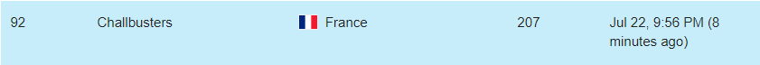
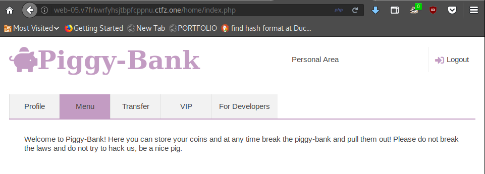
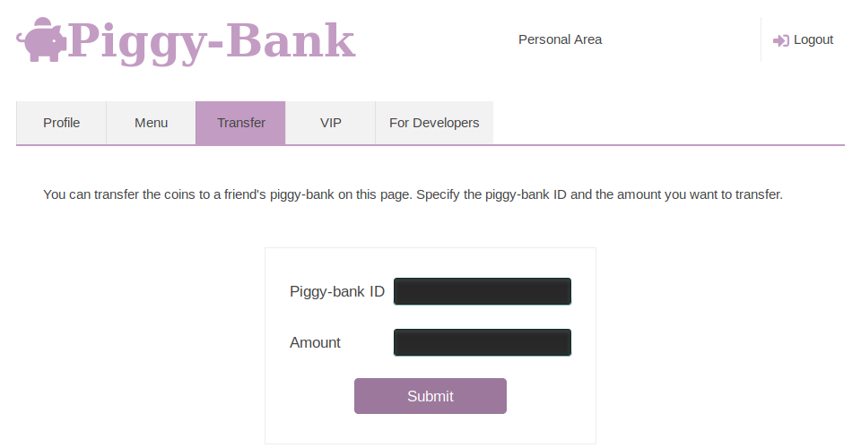
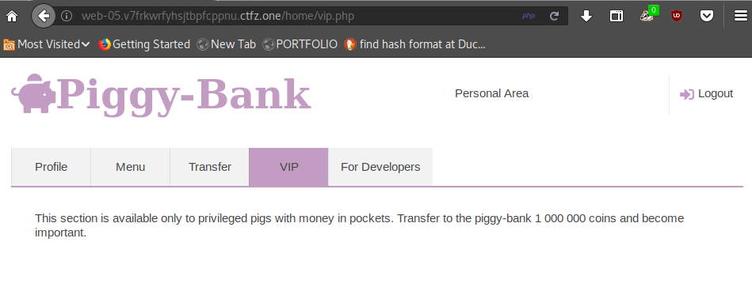
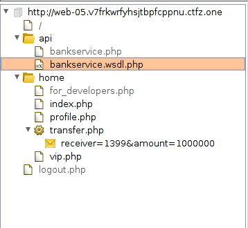
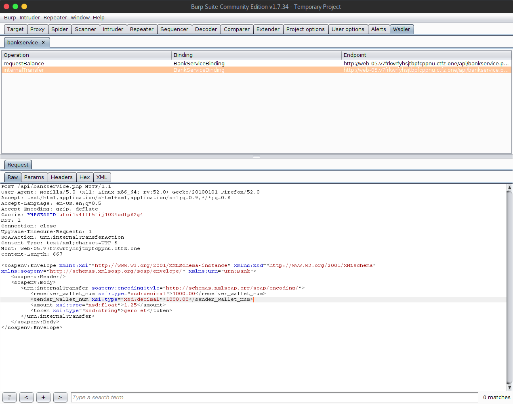
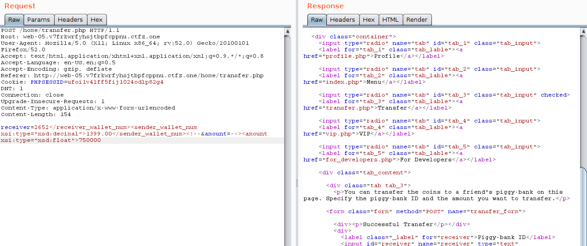
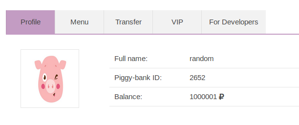
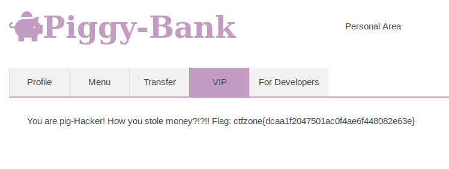

# ctfzone2018 Quals

J'ai pu participer à ce challenge via le site [ctftime](https://ctftime.org/event/632).

Après 36 heures de challenges, j'ai pu arriver à la 92 place.

Voici la solution de l'épreuve intitulé : Piggy-Bank

## Piggy-Bank

Au début de ce challenge, l'on arrive sur l'interface web d'une banque. Il est possible de s'inscrire afin d'obtenir un compte avec une somme de départ de 100 crédits.

Il est possible d'effectuer des transferts en connaissant l'id d'un autre membre : 

La page VIP attire notre attention car c'est la seule qui n'est pas accessible totalement. En effet, il nous est demandé d'avoir 1 000 000 de crédits pour y a  accéder.

En regardant le site d'un peu plus près avec burp, l'on peux remarquer un fichier /api/bankserver.wsdl.php. 

Ce fichier nous permet de trouver deux requêtes. Une permettant de voir le nombre de crédits d'un compte et l'autre permettant d'effectuer un transfert d'un compte vers un autre.

Le problème ici, est qu'il nous manque le token de vérification de la transaction. Et aucune page du site ou fonctionnalité ne semble pouvoir nous fournir cette information. On va donc essayer d'injecter le formulaire de transfert afin que le token soit généré automatiquement lors de l'envoi de cette requête côté serveur. Ainsi on pourra modifier l'addresse de la personne envoyant les crédits.

En résumé il faut : 
1. Utiliser la méthode permettant de vérifier le montant d'un compte afin de trouver un compte ayant le nombre de crédits requis.
2. Injecter notre code XML dans le formulaire afin de voler les crédits.

On voit que le requête se déroule sans accros avec la phrase *Succesfull Transfer*
Voyons voi notre nouveau montant de crédits : 

~~Ici , le montant ne correspond pas car j'ai effectué le challenge en deux requêtes~~

Nous pouvons donc maintenant avoir accès à la page VIP :

Nous pouvons y trouver le flag de cette épreuve.